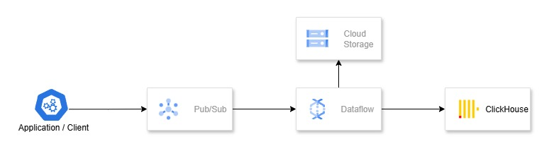
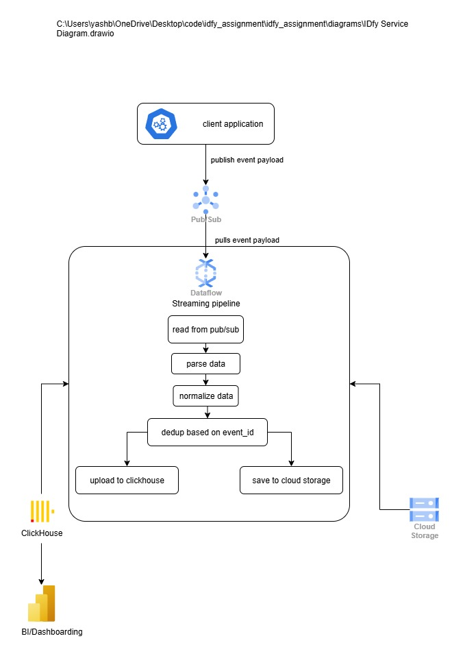
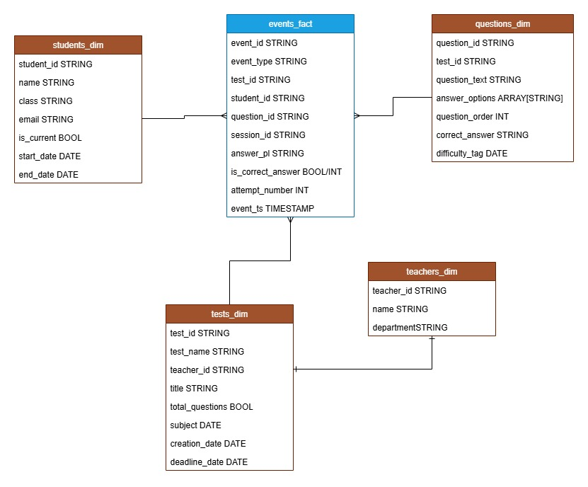
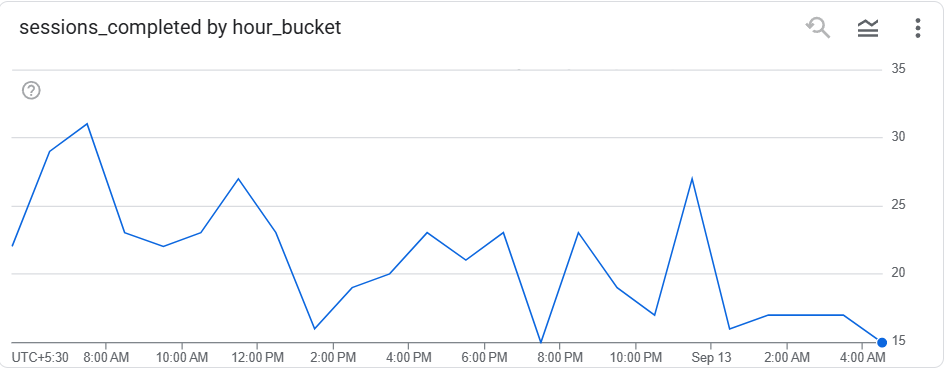
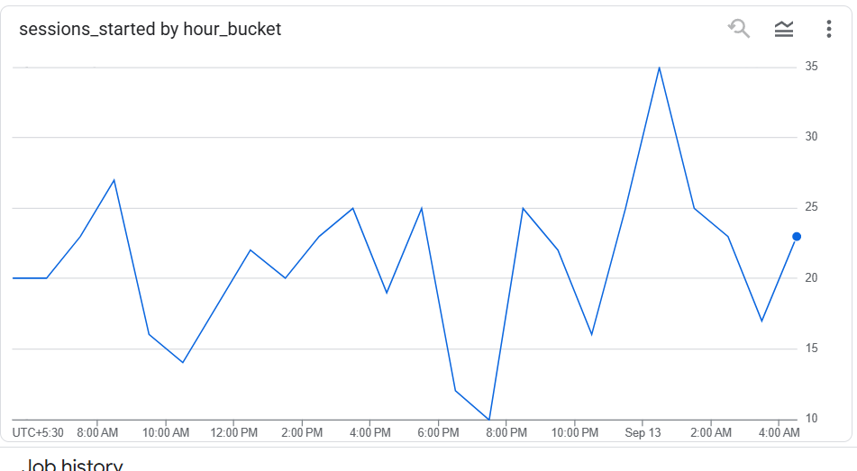
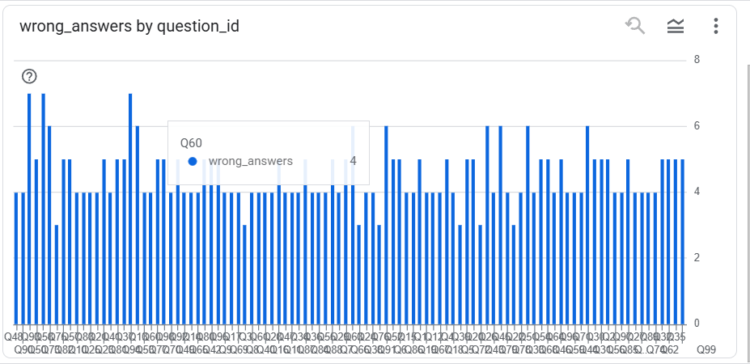

# IDfy_assignment
This repository is just to submit IDfy assignment

### Initial Thoughs
1. events_fact is supposed to be the only source_of_truth (All the event's raw data inserting in events_fact)
2. views on top of events_fact will create other facts while agregating the values incoming, such as session_view(one session per row, test_view one test per row,question_view one question per row)
3. On top of the views we'll have BI connect


### handling given error cases 

1) While submitting a question or test, the store call fails due to some system issue.
    - Implementing retry logic for the call on app side
    - App should emit event before or in parallel to writing to db
    - In anyway we should also recieve the failed event message in the PubSub so i have included store_error as one of the event type.
        - It could also be a simple error event with error_payload message stating "db_store_failed" or "client_error" which can be pushed to DLQ for failed event messages


2) There is a bug in your app due to which students can submit the answers to any question or
submit the test even 15 minutes after the session has expired.
    - Using is_late_submission_flag
        - If there's session_start_time in the payload this can be calculated on the go in apache_beam. 
        - If not available
            - can be checked on the client-side and sent in payload.
            - can be indentified using query on the data in warehouse


## Service Design Diagram



## Data Pipeline Design



## Data Model

    - Fact table 
        1. events_fact
        2. sessions_fact (one session per row) (I haven't included it in the diagram)
    - Dimension tables
        1. students_dim (SCD Type 2)
        2. questions_dim
        3. teachers_dim
        4. tests_dim




### event_payload from application
This is the event_payload which i have supposed that we'll receive from application into our messagebus per event.

```
{
    event_id STRING,
    event_type STRING, [session_start,session_end,page_view,answer_submit,answer_resubmit,test_submit,store_error]
    test_id STRING,
    student_id STRING,
    question_id STRING,
    session_id STRING,
    answer STRING NULLABLE,
    is_correct_answer INT/BOOL NULLABLE,
    attempt_no INT,
    client_ts TIMESTAMP
}
```


## Queries for view/dashboards
### session_summary_fact in view 
```
with session_summary as (SELECT
    session_id,
    ANY_VALUE(test_id)       AS test_id,
    ANY_VALUE(student_id)    AS student_id,

    -- Session start/end times
    MIN(CASE WHEN event_type = 'session_start' THEN client_ts END) AS session_start_time,
    MAX(CASE WHEN event_type = 'session_end'   THEN client_ts END) AS session_end_time,

    -- If session_end missing, fallback to last event
    COALESCE(
        MAX(CASE WHEN event_type = 'session_end' THEN client_ts END),
        MAX(client_ts)
    ) AS effective_session_end_time,

    # Session Level Stats
    COUNTIf(event_type IN ('page_view'))                        AS total_page_views,
    COUNTIf(event_type IN ('answer_submit', 'answer_resubmit')) AS total_answers_submitted,
    COUNTIf(event_type = 'answer_resubmit')                     AS total_resubmits,
    COUNTIf(event_type = 'store_error')                         AS total_store_errors,
    COUNTIf(event_type = 'test_submit')                         AS test_submit_flag, -- 0/1 if session submitted
    COUNTIf(event_type = 'answer_submit' AND is_correct_answer is true) AS correct_answers,
    COUNTIf(event_type = 'answer_submit' AND is_correct_answer is false) AS wrong_answers,

FROM events_fact
GROUP BY session_id)
select *,datetime_diff(session_start_time,session_end_time, SECOND) duration from session_summary where session_start_time is not null and session_end_time is not null;
```

### questions_summary_fact in view 
```
SELECT
    test_id,
    question_id,

    -- Engagement
    COUNTIf(event_type = 'page_view')                   AS total_page_views,
    COUNTIf(event_type IN ('answer_submit','answer_resubmit')) AS total_attempts,
    COUNTIf(event_type = 'answer_resubmit')             AS total_resubmits,

    -- Performance
    COUNTIf(event_type = 'answer_submit' AND is_correct_answer is true) AS correct_answers,
    COUNTIf(event_type = 'answer_submit' AND is_correct_answer is false) AS wrong_answers,


    -- Difficulty proxy = wrong / attempts
    if(
        count(attempt_no) > 0,
        COUNTIf(event_type = 'answer_submit' AND is_correct_answer is false) / count(attempt_no),
        0
    ) AS wrong_answer_rate,

    -- First/last interaction
    MIN(client_ts) AS first_seen_ts,
    MAX(client_ts) AS last_seen_ts,

FROM events_fact
WHERE question_id IS NOT NULL
GROUP BY test_id, question_id;
```

## Screenshot of some KPIs







